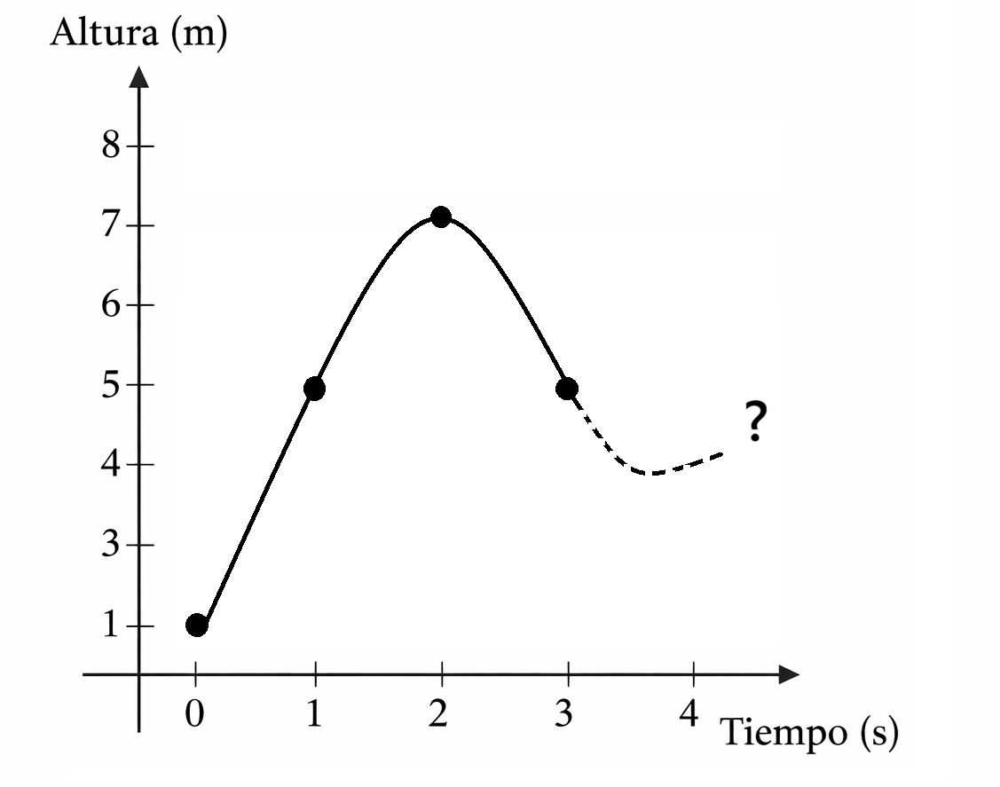

# 🕵️‍♀️ Detective de Funciones  
## Caso 2: El lanzamiento inesperado

**Nivel:** 2° Medio – Matemática  
**Proyecto:** Detective de Funciones  
**Tipo de recurso:** Guía de trabajo (aprendizaje basado en casos)

---

## 1. Propósito del caso
Analizar una situación de movimiento que no presenta crecimiento constante para **identificar, justificar e interpretar una función cuadrática**, utilizando evidencias y razonamiento matemático.

---

## 2. Contexto del caso
Durante una actividad deportiva, un estudiante lanza una pelota verticalmente hacia arriba. Un sensor registra la **altura de la pelota en función del tiempo**, pero los datos fueron entregados de manera parcial.

Tu misión como detective matemático es **reconstruir el comportamiento del movimiento**, identificar el tipo de función que lo representa y justificar tu decisión utilizando las evidencias disponibles.

---

## 3. Evidencias entregadas

### Evidencia 1: Tabla parcial

| Tiempo (s) | Altura (m) |
|-----------|------------|
| 0         | 1          |
| 1         | 5          |
| 2         | 7          |
| 3         | 5          |
| 4         | ?          |

---

### Evidencia 2: Descripción del fenómeno
- La pelota asciende rápidamente al inicio.
- Alcanza una **altura máxima** y luego comienza a descender.
- El movimiento presenta **simetría respecto al punto más alto**.

---

### Evidencia 3: Representación gráfica incompleta
El siguiente gráfico muestra parte del comportamiento de la altura de la pelota en función del tiempo. El último punto no ha sido completado.

---

## 4. Preguntas de investigación

1. ¿Qué tipo de función representa esta situación?  
   - Lineal  
   - Cuadrática  
   - Exponencial  

2. ¿Qué evidencias te permiten descartar una función lineal?  
   Explica.

3. ¿En qué instante ocurre la altura máxima?  
   ¿Cómo lo dedujiste a partir de los datos?

4. Estima el valor de la altura cuando el tiempo es 4 segundos.  
   Justifica tu respuesta.

5. Describe con tus palabras la forma que tendría el gráfico completo.

---

## 5. Pensamiento computacional involucrado
En este caso se desarrollan las siguientes habilidades:
- Reconocimiento de patrones no constantes  
- Abstracción del comportamiento global  
- Análisis de simetría  
- Toma de decisiones a partir de evidencias  

---

## 6. Cierre reflexivo
Responde brevemente:

- ¿Por qué esta situación no puede modelarse con una función lineal?
- ¿Qué importancia tiene el punto máximo en la interpretación del fenómeno?
- ¿En qué otras situaciones reales aparecen comportamientos similares?

---

## 7. Orientaciones para el docente
- El caso corresponde a una **función cuadrática con concavidad hacia abajo**.  
- El foco está en la **interpretación del vértice y la simetría**, no en el cálculo exacto de la expresión algebraica.  
- Se sugiere trabajo individual o en parejas y discusión final guiada.

---

## 8. Evaluación sugerida (formativa)
> Lista de cotejo de uso docente. Los indicadores se marcan en formato impreso o digital.

| Indicador | Logrado | En proceso |
|---------|--------|------------|
| Identifica correctamente una función cuadrática | ⬜ | ⬜ |
| Reconoce el punto máximo del fenómeno | ⬜ | ⬜ |
| Justifica usando evidencia matemática | ⬜ | ⬜ |
| Participa en la reflexión final | ⬜ | ⬜ |

---

## 9. Nota de autoría
Este caso forma parte del proyecto **Detective de Funciones**, una propuesta didáctica original orientada al desarrollo del pensamiento computacional y la interpretación de funciones en enseñanza media.
